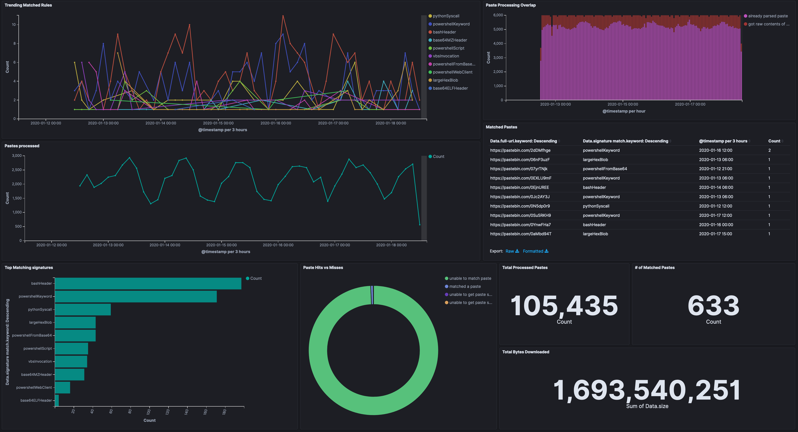

# pastescraper

A utility to scrape pastebin's incoming feed for known malware techniques.

You must have your ip whitelisted with pastebin for this to work.
[pastebin scraping docs](https://pastebin.com/doc_scraping_api)

## Usage

```go
// NOTE: This code does not check errors

c := &config{}
// fill in configuration info
err := c.getConf(configPath)

// load the requested parsers
parser, err := parse.New(c.Parsers)

// create the scraper with the loaded parsers
scraper, err := New(c, parser)

// start scraping
err = scraper.start(context.Background(), time.Second * 10)
```
## Getting Started

### Standalone Docker Container
The easiest way to test the service itself is to create the following config file named `config.yml`

```yaml
outputdir: "./pastes"
debug: False
maxqueuesize: 20
elastic:
  https: False
  username: ""
  password: ""
  host: ""
  port: 0
  index: ""
parsers: ["base64MZHeader", "base64ELFHeader", "powershellKeyword", "powershellScript", "powershellWebClient", "pythonSyscall", "bashHeader", "vbsInvocation", "powershellFromBase64"]

```

Then creating the docker container with
```bash
docker build -t pastescrape:latest .
```

And starting the service with the newly created config file.

```bash
docker run -v ${PWD}/myconf.yml:/app/config.yml pastescrape:latest
```

The config file does support logging to an elasticsearch instance, so if that is configured those values can be filled in.

## Screenshots

